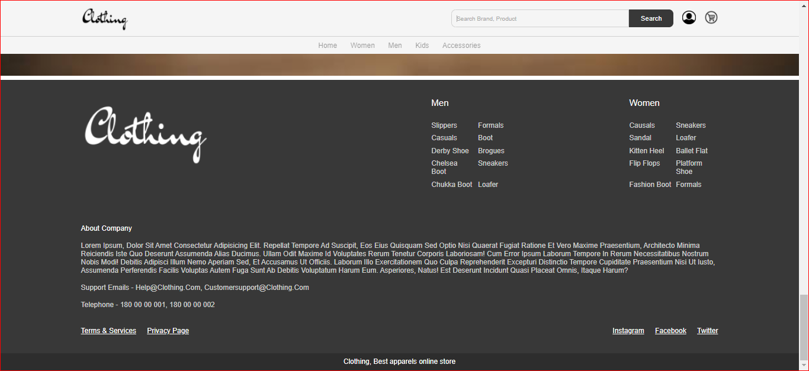

# E-Commerce Website

This is a simple E-Commerce website created using HTML, CSS, and JavaScript. It includes a header, footer, and a product list.

## Features

- Header with navigation links.
- Footer with copyright information.
- Product list with details and images.
- JavaScript functionality for interactive features.

## Technologies Used

- HTML
- CSS
- JavaScript

## Usage

1. Clone the repository:

   ```shell
   git clone https://github.com/bhuvaneshwar-2002/e-commerce-website.git

## Screenshots



